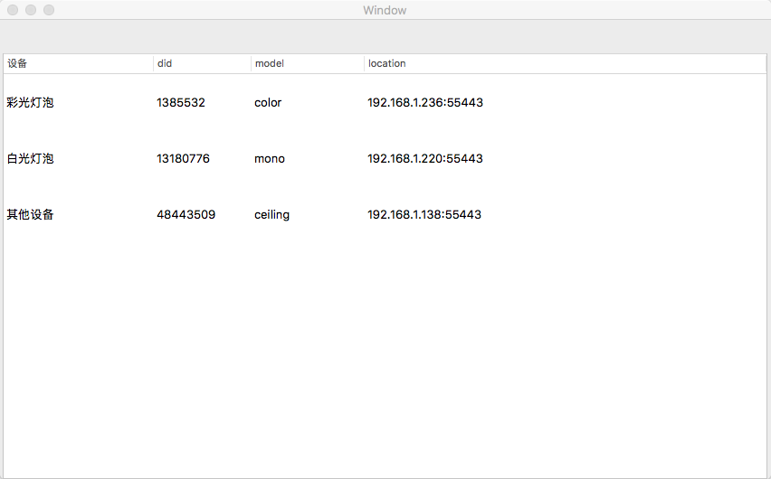
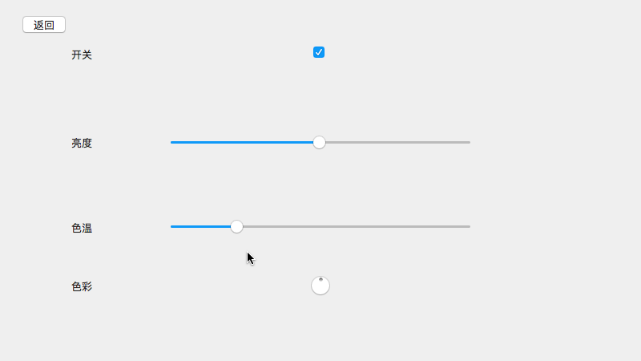

# yeelight-mac
this is a demo using yeelight open (SSDP-like) API to find and control yeelight wifi LEDs.

including：

1. Searching bulbs in the local area network
2. Turn On / Off
3. Changing brightness, colors and color temperature

you can find the docs about yeelight open api

[Yeelight Open API](https://www.yeelight.com/en_US/developer)
# Screenshots

